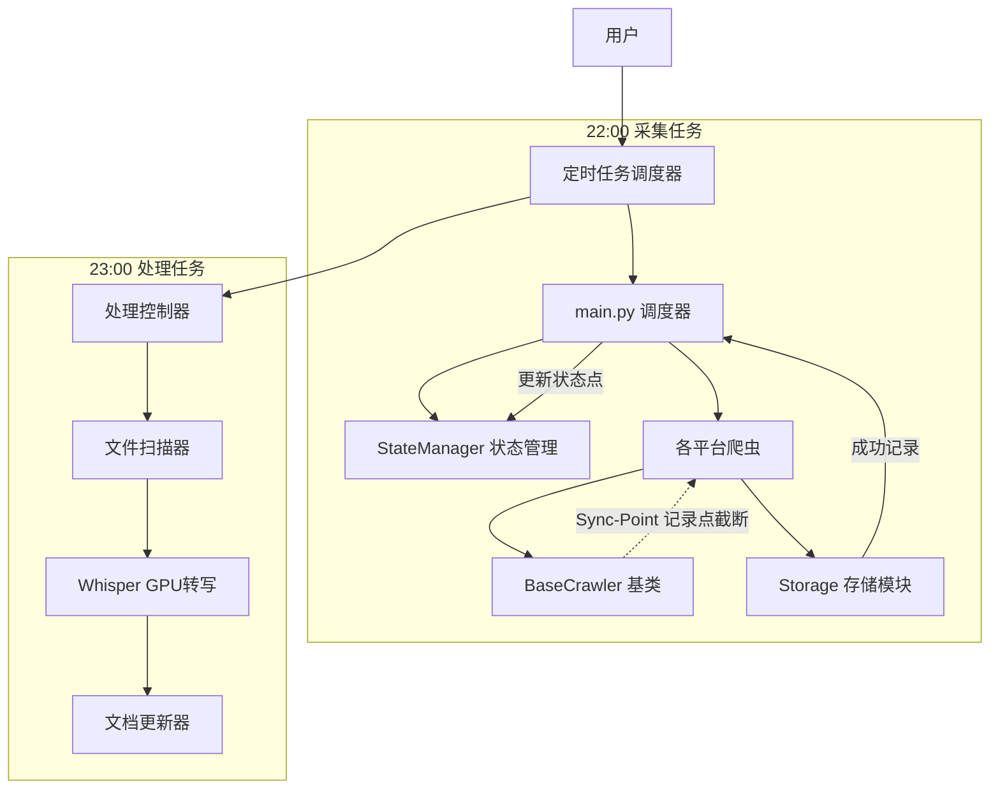

# 系统架构说明书

## 1. 架构设计原则
- **模块化设计**: 每个平台的爬虫作为一个独立的 Module 类，继承自基类 `BaseCrawler`，实现 `fetch_new_contents()` 方法。
- **配置分离**: 此项目的 Cookie、API Key 等敏感信息存储在 `.env` 或 `config.py` 中，不硬编码。
- **数据统一**: 所有爬虫输出统一的 `ContentItem` 数据类，由 `StorageManager` 统一写入磁盘。

## 2. 系统分层架构

## 3. 核心代码模块列表 (Core Modules)

### 3.1 基础模块 (`crawlers/base.py`)
- **BaseCrawler**
    - 输入: `config` (dict)
    - 输出: `List[ContentItem]`
    - 核心逻辑: 定义 `fetch_list`, `parse_detail`, `download_assets` 抽象接口。

### 3.2 平台实现模块

#### **XHSCrawler** (`crawlers/xhs.py`)
- **依赖**: 外部加载 `Spider_XHS` 模块。
- **重点**: 解决图片 403 屏蔽（添加 Referer/UA），解析嵌套的 `image_list` 结构。

#### **BiliCrawler** (`crawlers/bilibili.py`)
- **依赖**: `bilibili-api-python` (第三方库)
- **核心方法**: `user.get_favorites_list()`, `video.get_subtitle()`
- **兜底逻辑**: 若 `get_subtitle()` 为空且启用 Whisper，则通过 `MediaTool.transcribe()` 进行后端异步转写。

#### **DouyinCrawler** (`crawlers/douyin.py`)
- **策略**: 使用 `domcontentloaded` 等待结合手动滚动触发接口拦截。
- **依赖**: `playwright`
- **核心方法**: `page.goto()` -> 拦截 `aweme/v1/web/aweme/favorite` 响应内容。

#### **WeChatCrawler** (`crawlers/wechat.py`)
- **依赖**: `aiofiles` (读取链接文件), `html2text` (HTML转Markdown)
- **输入**: 读取 `F:\DataInput\wechat_urls.txt` 中的链接进行抓取。

### 3.3 数据处理模块 (`processor/main.py`) [NEW]
- **处理任务**: 每日 23:00 自动启动。负责扫描媒体文件：
    - 对于音频 (B站音轨): 直接转写。
    - 对于视频 (小红书/其他): **提取音频** -> 转写。
    - 对于图片 (小红书/其他): **OCR 识别** -> 文本存入 MD。
- [✓] **增量同步 (Sync-Point)**: 
    - 系统不再全量扫描，而是记录上次抓取的“最新作品 ID”。
    - 采集时一旦探测到记录中的 ID，立即停止更早内容的下载，实现极速增量。
- **核心逻辑**:
    1.  遍历 `F:\DataInput\YYYY-MM-DD`。
    2.  识别文件夹内的 `.wav` 文件。
    - **4. AI 转写子模块 (Whisper)**:
        - 输入: `audio.wav`
        - 输出: 文本字符串。
        - 逻辑: 调用 Whisper `model.transcribe`。
    - **5. 图片 OCR 子模块 (EasyOCR)**:
        - 输入: `assets/*.jpg`
        - 输出: 文本字符串。
        - 逻辑: 调用 EasyOCR `reader.readtext`。
    3.  调用 `MediaTool.transcribe_file(path)` (GPU加速)。
    4.  读取同目录下的 `.md` 文件，将结果追加到 "字幕/文稿" 区域。

### 3.3 媒体处理模块 (`utils/media_tool.py`)
- **定位**: 跨平台通用媒体工具，目前主要用于 B 站转写。
- **核心技术**: `yt-dlp` (音频提取), `openai-whisper` (语音识别)。
- **路径定义**:
    - **音频暂存**: `F:\Spider_proj\temp` (存放 `.wav` 中间文件)。
    - **模型存储**: `F:\Spider_proj\models` (存放 Whisper 模型权重)。
- **转写核心逻辑**:
    1.  **下载**: 使用 `yt-dlp` 提取 `bestaudio` 并转换为 `.wav` 格式，**直接保存至帖子专属文件夹**。
    2.  **解耦**: 在采集借端**不执行**转录操作，也不删除音频文件。
    3.  **转录服务**: 提供独立的 `transcribe_file(path)` 静态方法，供 Processor 模块调用。
- **性能参考**:
    - `base` 模型下，1小时音频处理约需 5-15 分钟（单核 CPU）；GPU 模式下可缩短至 1-3 分钟。

### 3.5 状态管理模块 (`utils/state_manager.py`) [NEW]
- **定位**: 跨平台同步状态持久化。
- **职责**: 读写 `crawl_state.json`，存储各平台最近一次处理成功的最新 ID。
- **特性**: 支持原子更新，确保仅在采集保存全部成功后才移动同步点。

## 4. 技术选型
- **语言**: Python 3.9+
- **网络库**:
    - `aiohttp`: 异步下载资源。
    - `playwright`: 动态渲染与风控对抗 (Douyin)。
    - `bilibili-api`: B站专用 Client。
- **调度**: `APScheduler` (AsyncIOScheduler)
- **解析**:
    - `BeautifulSoup4`: HTML 清洗。
- **数据类**: `dataclasses` (统一交换格式)
- **日志**: `loguru`
- **存储**: `jinja2` (Markdown 模板渲染), `aiofiles` (异步文件 I/O)

## 5. 核心难点与解决状态
- [✓] **小红书 403 下载限制**: 通过在 `download_asset` 中添加自定义 Headers 解决。
- [✓] **抖音 Playwright 超时**: 调整 `wait_until` 策略为 `domcontentloaded` 并增加缓冲时间。
- [✓] **B站无字幕转写**: 引入本地 `Whisper` 模型作为兜底，解决 ASR 识别需求。
- [✓] **MediaTool (Whisper Provider)**: 已实现在 `yolov5` 环境下的异步语音转文字，并支持 GPU (CUDA) 加速。
- [✓] **Conda 环境 SSL 报错**: 通过手动补全 `yolov5` 环境下的 OpenSSL DLLs 解决。

## 需求追踪
- [x] 架构设计完成
- [x] 模块接口定义
- [x] 技术选型确认
- [x] Whisper 集成细化